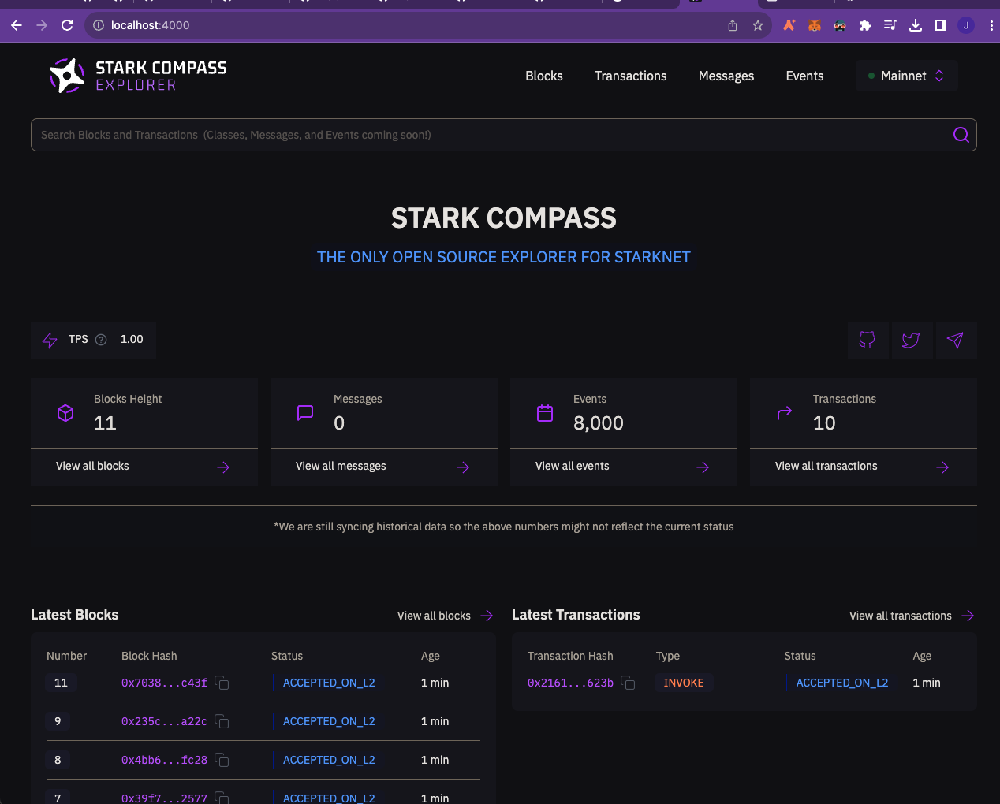
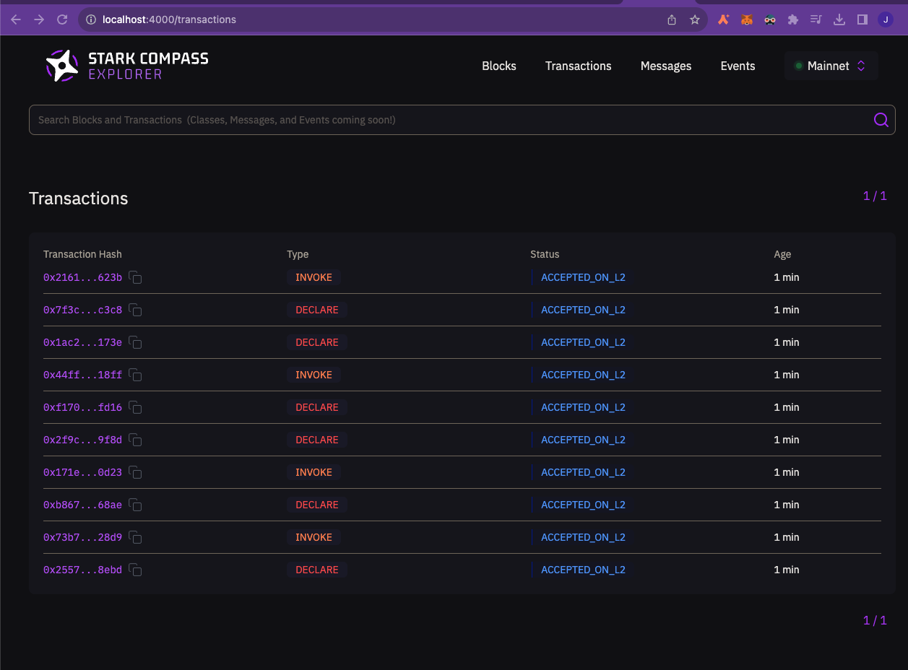
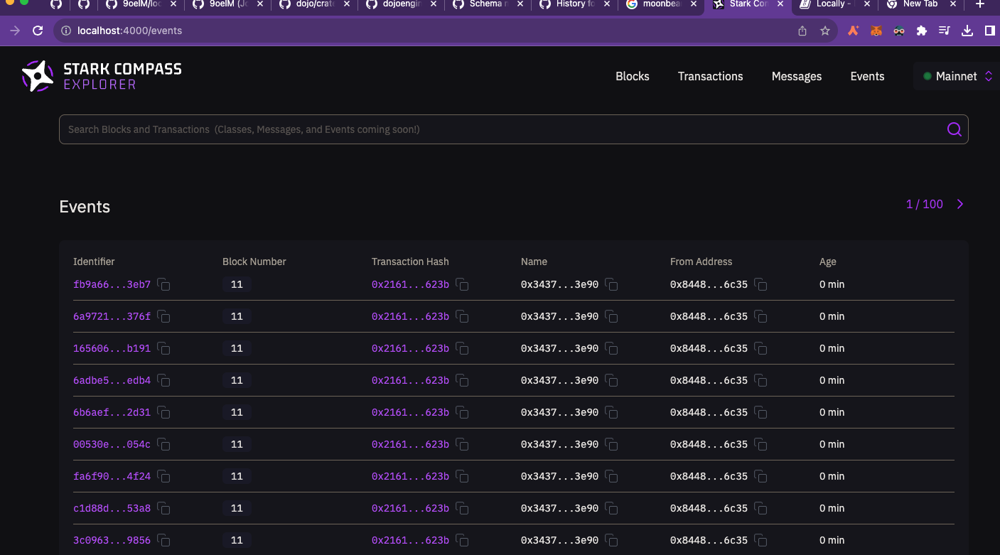
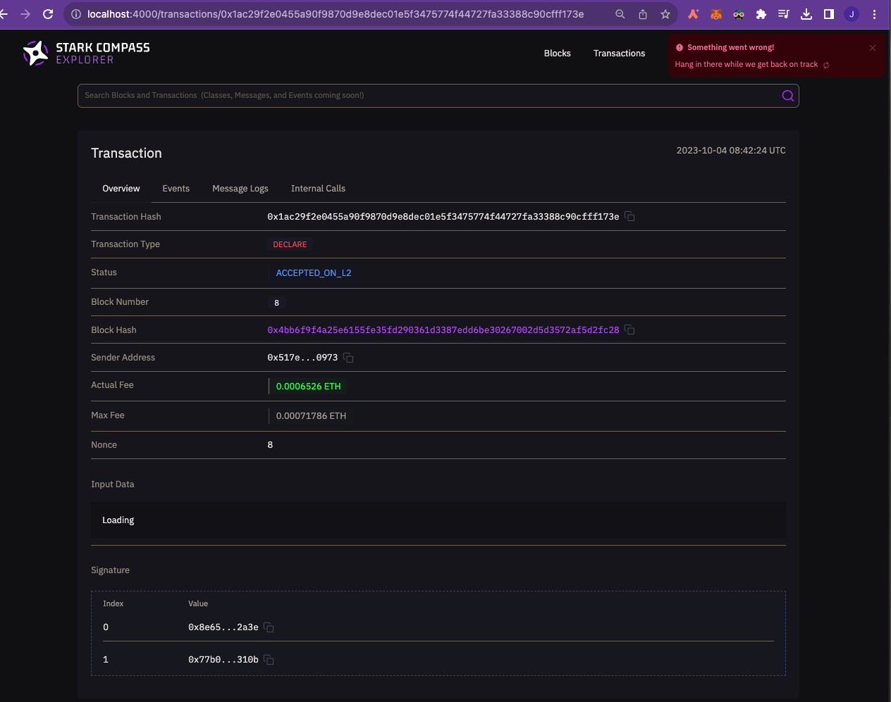
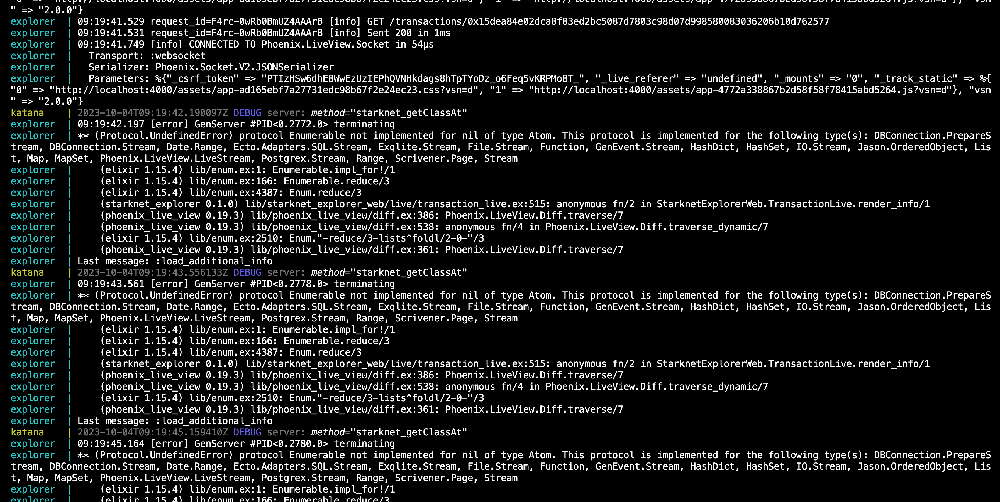

# local-rpc-explorer

A `docker-compose` setup to view the [explorer](https://github.com/lambdaclass/stark_compass_explorer) connected with a local [`katana`](https://github.com/dojoengine/dojo/tree/main/crates/katana) instance.

## Quickstart

Install the latest versions of [starkli](https://github.com/xJonathanLEI/starkli) and [`dojoup`](https://book.dojoengine.org/getting-started/quick-start.html) and run `docker-compose up`.

Once `docker-compose up` successfully runs, the explorer will be available at http://localhost:4000. Note that due to the server checking the origin of the request, http://127.0.0.1:4000 won't work.

## Test transactions

By default, blocks won't be created unless transactions take place. This means you will see nothing on the explorer.

Because the transactions won't take place unless you create one, you can try something like below.

Deploy the contract inside `/example-contract` folder:

```console
cd example-contract

# sozo should have been installed when installing dojoup
sozo build

sozo migrate --name test
```

You also can try to use `starkli` to test transfer too:

```console
starkli invoke eth transfer 0x5006399928dad095cc39818cae15dc022592d47d883701e7814c9db19e96efc u256:1 --account ./account0_account.json --keystore ./account0_keystore.json --rpc http://0.0.0.0:5050

# keystore password = 0
```

Katana will always create the same accounts for you unless you customize the seed, so you can use the existing `./account0_*.json` on your local.

Once you deploy the contract or invoke the transfer transaction, you will be able to see something like:





## Todo

### Transaction details page

Transaction details page is still quirky. It still keeps showing errors, and 'event', 'message logs', 'internal calls' are not clickable, and most importantly, 'input data' is not showing up:



And this is the log from cli as soon as the transaction details page is entered:



It complains about something but I really have no idea

### Events

Needs more checking, but the events page shows duplicate events with the same transaction hash too many times:


